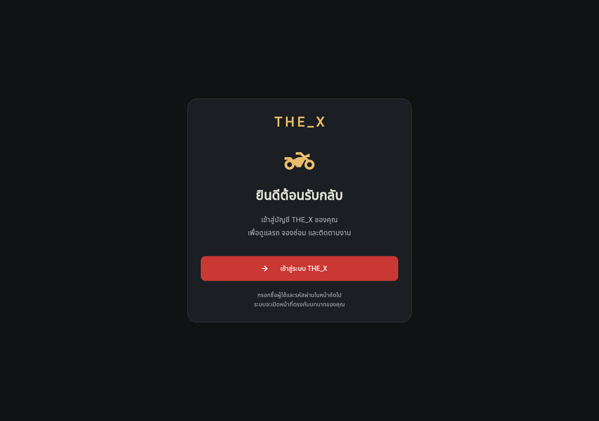
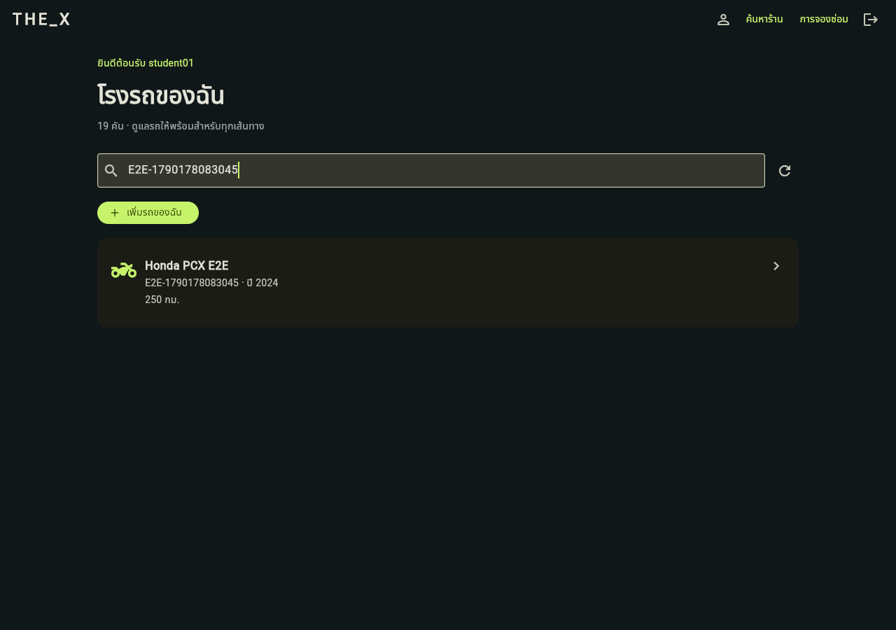
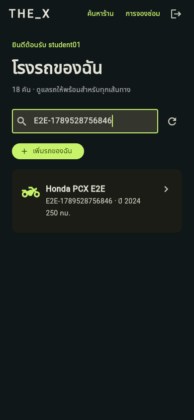

# THE_X

แอปดูแลรถจักรยานยนต์ พัฒนาต่อยอดแนวคิดจาก [THE_ONE](https://github.com/zxSUPHASANxz/THE_ONE_FINAL/tree/f4db01a) เวอร์ชันก่อนเปลี่ยนหน้า chatbot เป็นธีมแดง–ทอง งานรายวิชาอยู่บน branch `project`

สถานะการส่งมอบและหลักฐานทดสอบ: [ขอบเขตแรก](docs/phase-1-status.md), [ขอบเขตสอง](docs/phase-2-testing.md), [ขอบเขตสาม — ระบบร้าน](docs/phase-3-testing.md), [ขอบเขตสี่ — บัญชีและโปรไฟล์](docs/phase-4-testing.md)

ปิดขอบเขตสี่สำหรับ Flutter Web แล้ว: [สมัครสมาชิกทั่วไป/ผู้ให้บริการ พร้อมเบอร์โทร รูปร้าน และหมุดแผนที่](docs/phase-4-registration.md), ปุ่มแสดงรหัสผ่านทุกหน้า, [โปรไฟล์ลูกค้า/ช่าง](docs/phase-4-profile.md) และ session OIDC แยกแท็บ การสมัครปัจจุบันไม่บังคับอีเมลและเข้าใช้ได้ทันที ส่วนการรีเซ็ตด้วย username เปิดเฉพาะ Docker demo บน localhost; [บันทึกการเปลี่ยน flow บัญชี](docs/phase-4-email-accounts.md)

ต้องการให้โทรศัพท์หรือคอมพิวเตอร์เครื่องอื่นในเครือข่ายเดียวกันทดลองใช้ ให้ทำตาม [คู่มือเปิด THE_X ผ่าน LAN](docs/lan-access.md)
หากอยู่นอกเครือข่ายเดียวกัน ใช้ [คู่มือ public HTTPS tunnel ด้วย ngrok](docs/public-tunnel.md)
หากต้องการรันทั้งระบบใน Docker Compose ใช้ [คู่มือ Docker deployment](docs/docker-deployment.md) ซึ่งแยก volume จากฐานข้อมูลพัฒนาเดิม

## Features — ขอบเขตแรก

- Flutter Web: ล็อกอินผ่าน Django OIDC ด้วย Authorization Code + PKCE S256
- เก็บ session ผ่าน `flutter_secure_storage` และตรวจสิทธิ์ก่อนเข้าโรงรถ
- โรงรถส่วนตัว: เพิ่ม ดูรายละเอียด แก้ไข และลบรถ พร้อม validation และยืนยันก่อนลบ
- Backend จำกัดข้อมูลตามเจ้าของ ทั้งการอ่านและการแก้ไข
- ค้นหารถด้วยยี่ห้อ รุ่น หรือทะเบียน และ layout สำหรับหน้าจอมือถือ/desktop
- แสดงข้อผิดพลาดเมื่อเชื่อมต่อ API ไม่สำเร็จ และโหลดใหม่ได้
- Logout ทุก session ของบัญชีนี้ใน THE_X: เพิกถอน access/refresh tokens, ล้างข้อมูล session ในแอป และออกจาก Django OIDC

## Features — ขอบเขตสอง

- ลูกค้าจองซ่อมรถของตัวเอง เลือกวันเวลา ระบุอาการ ติดตามสถานะและประวัติ
- ช่างรับงาน เริ่มซ่อม และบันทึกผลก่อนปิดงาน มีสิทธิ์จัดการเฉพาะงานที่รับ
- ยกเลิกได้ก่อนเริ่มซ่อม ป้องกันจองรถซ้ำและช่างรับงานเดียวกันพร้อมกัน
- ข้อมูลประวัติรถได้รับการป้องกันจากการลบ

ดู [การเตรียมบัญชีช่างและขั้นตอนทดสอบขอบเขตสอง](docs/phase-2-testing.md)

## Features — ขอบเขตสาม

- ค้นหาร้านด้วยชื่อ/ที่อยู่ ดูข้อมูลติดต่อ และเลือกร้านก่อนจองซ่อม
- ช่างเห็นงานเฉพาะร้านที่ผู้ดูแลกำหนดสมาชิกให้ ร้านอื่นอ่านหรือรับงานไม่ได้
- แก้ข้อมูลร้านและเปิด/ปิดรับจองใหม่ พร้อมยกเลิกงานก่อนเริ่มซ่อมโดยระบุเหตุผล
- ผู้ดูแลสร้างร้าน/กำหนดช่างผ่าน Django admin; ประวัติการจองเดิมยังอยู่ครบ

ดู [วิธีเตรียมร้าน จัดการสมาชิก และทดสอบขอบเขตสาม](docs/phase-3-testing.md) กติกาการจองแยกร้านในขอบเขตนี้ใช้แทนคิวกลางเดิมของขอบเขตสอง

## Features — ขอบเขตสี่

- สมัคร Customer หรือ Mechanic; ผู้ให้บริการต้องระบุข้อมูลร้าน รูป ที่อยู่ และหมุดแผนที่
- สมัครแล้วเข้าใช้ได้ทันทีโดยไม่บังคับอีเมล; รีเซ็ตรหัสด้วย username เฉพาะ Docker demo บน localhost โดยไม่อนุญาตบัญชี Admin
- Customer และ Mechanic แก้ข้อมูลส่วนตัวของตน โดยการเปลี่ยนอีเมลต้องยืนยันก่อน
- เก็บ OIDC token/PKCE ใน `sessionStorage`: reload แท็บเดิมยังอยู่ แต่แท็บใหม่เริ่ม Login และใช้หลายบัญชีพร้อมกันได้
- เปิดผ่าน LAN สำหรับเครือข่ายทดสอบ หรือ ngrok HTTPS URL เดียวสำหรับ Flutter, API และ OIDC

ดู [ผลตรวจและเกณฑ์ปิดขอบเขตสี่](docs/phase-4-testing.md)

ส่วนที่ยังไม่ได้ทำ: แชท AI/n8n การส่งอีเมลผ่าน SMTP จริง และ production deployment ถาวร รุ่นนี้ยังเป็น **Flutter Web สำหรับ local/temporary demo** ไม่ใช่ Android/iOS build หรือ production deployment วันนัดเป็นคำขอ ยังไม่มีระบบคำนวณช่องเวลาว่างของร้าน

## ใช้ Admin, Mechanic และ Customer พร้อมกัน

ผลตรวจและขั้นตอนทดสอบ: [บัญชีและบทบาท](docs/accounts-and-roles.md)

เปิด Backend และ Frontend Preview ตาม How to Run ก่อน จาก PowerShell อีกหน้าต่างรัน:

```powershell
Set-Location 'D:\Project\Project_Flutter\mobiledev69'
& '.\backend\.venv\Scripts\python.exe' '.\scripts\open_test_profiles.py'
```

สคริปต์เปิด Chrome สาม profiles แยกกัน (Admin, Mechanic, Customer) เก็บไว้ใน `.local/browser-profiles/` ซึ่ง Git ignore แล้ว ไม่ต้องลงชื่อเข้า Google กรอกบัญชี THE_X ตามบทบาทในแต่ละหน้าต่าง ชื่อ profile เป็นเพียงป้ายกำกับ ไม่ได้ให้สิทธิ์แก่บัญชี

ใช้ `student01` สำหรับ Customer และ `mechanic01` สำหรับ Mechanic ตามบัญชี demo เดิม Admin ใช้ superuser ของคุณ หากยังไม่มีให้สร้างโดยคำสั่งต่อไปนี้ แล้วกรอกรหัสผ่านเมื่อระบบถาม:

```powershell
Set-Location 'D:\Project\Project_Flutter\mobiledev69\backend'
uv run manage.py createsuperuser
```

Flutter Web เก็บ OIDC session แยกตามแท็บแล้ว: Admin, Mechanic และ Customer ล็อกอินพร้อมกันในแท็บของ Chrome profile เดียวกันได้ รีโหลดแท็บเดิมยังคงล็อกอิน แต่แท็บใหม่เริ่มที่หน้าเข้าสู่ระบบ ข้อมูลล็อกอินที่รุ่นเก่าเคยเก็บร่วมกันจะถูกลบเมื่อเปิดแอปรุ่นนี้ จึงต้องล็อกอินใหม่ครั้งเดียว ส่วน Django Admin (`localhost:8000`) ยังใช้ cookie ร่วมกันทั้ง profile หากต้องใช้ Django Admin หลายบัญชีพร้อมกันให้แยก Chrome profile

### Admin กำหนดและเปลี่ยนบทบาท

หน้า Django admin ปรับแนวทางจาก THE_ONE เวอร์ชัน `f4db01a` ให้เข้ากับข้อมูล THE_X:

- Users: ค้นหาชื่อ/อีเมล กรอง Adminuser, Mechanicuser, Customeruser และสถานะบัญชี
- Motorcycles: แสดงทะเบียน ยี่ห้อ รุ่น ปี เลขไมล์ เจ้าของ และค้นหาหรือกรองรถได้ เจ้าของรถเดิมเป็น read-only เพื่อป้องกันเปลี่ยนเจ้าของจนประวัติงานไม่ตรงกัน
- Shops: ค้นหาชื่อ ที่อยู่ โทรศัพท์ หรือชื่อช่าง กรองการรับจอง และดูจำนวนสมาชิกช่าง
- Bookings: ค้นหาหมายเลขงาน ลูกค้า ช่าง รถ หรืออาการ กรองสถานะ/ร้าน/วันนัด พร้อมประวัติเปลี่ยนสถานะในหน้าเดียว
- Booking events: ค้นประวัติตามงานและผู้ดำเนินการ ดูได้อย่างเดียว การเปลี่ยนสถานะยังต้องผ่าน workflow ในแอป

ยังไม่มีเมนูฐานความรู้/Embedding, แชต และแจ้งเตือน เพราะฟีเจอร์เหล่านี้ยังไม่อยู่ใน THE_X รุ่นปัจจุบัน

1. ล็อกอิน Adminuser ใน profile Admin; Flutter จะเปิดหน้า `/admin` พร้อมปุ่ม **จัดการผู้ใช้และบทบาท**
2. ปุ่มเปิด Django admin → Users (`http://localhost:8000/admin/auth/user/`) หากมีหน้าล็อกอินให้ใช้บัญชี Admin เดิม
3. เพิ่มผู้ใช้หรือเลือกผู้ใช้เดิม แล้วเลือก **บทบาท THE_X** เป็น Customeruser / Mechanicuser / Adminuser และกด Save
4. หากเป็น Mechanicuser ให้เปิด Shops และกำหนดร้านที่ช่างเป็นสมาชิกด้วย บทบาทช่างอย่างเดียวไม่ให้สิทธิ์ทุกร้าน
5. ให้ผู้ใช้โหลดแอปใหม่หลังเปลี่ยนบทบาท Backend ตรวจสิทธิ์จากฐานข้อมูลในแต่ละคำขอ ไม่เชื่อบทบาทจาก Flutter

Adminuser คือ Django superuser ที่มีสิทธิ์ดูแลระบบทั้งหมด การกำหนดบทบาทผ่านหน้านี้จะแทนที่ groups/permissions เดิมด้วยสิทธิ์ของบทบาทที่เลือก เมื่อเปลี่ยนออกจาก Mechanic จะถอนสมาชิกของร้านด้วย แต่เก็บประวัติรถและการจองไว้ ต้องปิดงานซ่อมที่รับไว้ก่อนเปลี่ยนบทบาท ไม่อนุญาตลดสิทธิ์/ปิดใช้งาน Admin คนสุดท้าย และไม่เปิดให้ลบบัญชีจากหน้าจัดการนี้

เมื่อแก้ Flutter ให้ build ใหม่และเปิด URL ปกติ `http://localhost:50000/` ได้เลย ระบบจัดการ cache/service worker รุ่นเก่าอัตโนมัติและเก็บข้อมูลล็อกอินไว้ หากแก้สคริปต์ Preview ต้องหยุดตัวเก่าแล้วเริ่มใหม่ด้วย ไม่ต้องเปิดหน้า `/refresh`

## Tech Stack

- Flutter 3.44.2 / Dart 3.12.2
- Python 3.12.11, Django 5.2.17, Django REST Framework 3.16.1
- django-oidc-provider 0.8.4, PostgreSQL 17
- provider (DI), go_router (route guard), Dio (API), openid_client (OIDC)
- Flutter dependencies ตรึงด้วย `frontend/pubspec.lock`; Python ด้วย `backend/uv.lock`

โครงสร้าง: `frontend/lib/features/` แยก presentation (View/ViewModel), data (Repository), domain (Model); `frontend/lib/core/` เป็น API/Auth service และ Result pattern; `backend/garage/` เป็น API กับ OIDC integration

## Prerequisites

- [Flutter SDK](https://docs.flutter.dev/install) และ Chrome
- [uv](https://docs.astral.sh/uv/getting-started/installation/) สำหรับ Python/dependencies
- [Docker Desktop](https://docs.docker.com/desktop/setup/install/windows-install/) ต้องเปิดและรอ Engine พร้อมก่อนเริ่ม PostgreSQL
- [Git](https://git-scm.com/downloads)
- เฉพาะ browser test อัตโนมัติ: [Node.js](https://nodejs.org/) รุ่น LTS พร้อม npm

คำสั่งด้านล่างใช้ PowerShell ใน Windows โดยอ้างอิงโปรเจกต์ที่ `D:\Project\Project_Flutter\mobiledev69` และ Flutter SDK ที่ `D:\flutter` หากใช้เครื่องอื่นให้เปลี่ยนสองตำแหน่งนี้ตามจริง คำสั่ง Flutter ใช้ path เต็ม จึงรันใน Terminal ใหม่ได้โดยไม่ต้องตั้ง PATH:

```powershell
& 'D:\flutter\bin\flutter.bat' --version
uv --version
docker version
```

## How to Run

สำหรับเครื่องใหม่ clone branch `project`:

```powershell
git clone --branch project --single-branch https://github.com/mzxFENRIRxzm/mobiledev69.git
cd mobiledev69
```

สำหรับ workspace ปัจจุบัน:

```powershell
cd D:\Project\Project_Flutter\mobiledev69
git branch --show-current
```

### ตั้งค่าครั้งแรก

```powershell
Set-Location 'D:\Project\Project_Flutter\mobiledev69'
uv run --python 3.12 --no-project scripts/init_dev.py
docker compose up -d --wait
cd backend
uv sync --locked --python 3.12
uv run manage.py migrate
uv run manage.py bootstrap_dev
```

`init_dev.py` สุ่ม secrets และสร้าง `.env` ที่ถูก Git ignore ทั้ง root และ backend หากมีไฟล์อยู่แล้วจะไม่เขียนทับ: ข้ามคำสั่งนี้ในการรันครั้งถัดไป ส่วน `bootstrap_dev` รันซ้ำได้และไม่เปลี่ยนรหัสผ่านบัญชีเดิม

PostgreSQL ใช้ `127.0.0.1:55432` พร้อม Docker volume แยกของโปรเจกต์ ไม่มีการใช้ฐานข้อมูล THE_ONE เดิม

ถ้าตั้งค่าขอบเขตแรกไว้แล้ว ให้เตรียมบัญชีช่างตาม [คู่มือขอบเขตสอง](docs/phase-2-testing.md) จากนั้นใช้ migration และ bootstrap ร้านตาม [คู่มือขอบเขตสาม](docs/phase-3-testing.md) ก่อนทดสอบงานซ่อม

### เปิดแอปเพื่อทดสอบในแต่ละครั้ง

เปิด Docker Desktop และเปิด Server ทิ้งไว้ **2 Terminal**: Backend พอร์ต 8000 กับ Frontend Preview พอร์ต 50000 จากนั้นเข้าแอปที่ **http://localhost:50000/garage** ไม่ต้องเปิดลิงก์ Backend เอง Frontend จะเรียก API และพาไปหน้าล็อกอินให้

### Terminal 1 — Backend

เปิด Docker Desktop ให้ Engine พร้อม แล้วรันใน Terminal แรก:

```powershell
Set-Location 'D:\Project\Project_Flutter\mobiledev69'
docker compose up -d --wait
Set-Location 'D:\Project\Project_Flutter\mobiledev69\backend'
uv run manage.py runserver 127.0.0.1:8000
```

เมื่อเห็น `Starting development server` ให้เปิด Terminal นี้ทิ้งไว้ การเข้า `http://127.0.0.1:8000/` แล้วเห็น 404 เป็นเพราะ Django ไม่มี route `/` ไม่ใช่หน้าจอแอป

### Terminal 2 — Frontend Preview (ใช้ทดสอบด้วยตัวเองและ E2E)

เปิด Terminal ใหม่ แล้วรันทีละคำสั่ง:

```powershell
Set-Location 'D:\Project\Project_Flutter\mobiledev69\frontend'
& 'D:\flutter\bin\flutter.bat' pub get
& 'D:\flutter\bin\flutter.bat' build web --no-wasm-dry-run --no-web-resources-cdn
if ($LASTEXITCODE -ne 0) { throw 'Flutter build failed; fix the error before starting preview' }
Set-Location 'D:\Project\Project_Flutter\mobiledev69'
uv run --python 3.12 --no-project scripts/preview_web.py
```

เมื่อเห็น `THE_X preview: http://localhost:50000` ให้เปิด Terminal นี้ทิ้งไว้ แล้วเข้า **http://localhost:50000/garage** สำหรับลูกค้า หรือ **http://localhost:50000/jobs** สำหรับช่าง

Preview แสดงไฟล์จาก `frontend/build/web` หากแก้โค้ด Flutter ต้อง build ใหม่ก่อนจึงจะเห็นการเปลี่ยนแปลง เมื่อเปิดครั้งถัดไปโดยไม่ได้แก้โค้ด ใช้เฉพาะสองคำสั่งสุดท้ายเพื่อเริ่ม Preview ได้ คำสั่ง preview รองรับการรีเฟรช route `/callback`, `/garage`, `/login`, `/loading`, `/bookings` และ `/jobs`

ใช้ `localhost:50000` ให้ตรงทุกครั้ง ห้ามสลับเป็น `127.0.0.1:50000` ใน browser เพราะ origin ของ storage และ OIDC redirect ต่างกัน

ค่าที่ต้องตรงกัน: Flutter `FRONTEND_URL`, OIDC client redirect `http://localhost:50000/callback`, post-logout redirect `http://localhost:50000/login` และพอร์ตที่ใช้รัน Flutter

Backend local อยู่ที่ `http://localhost:8000`; API คือ `/api/motorcycles/`, `/api/shops/`, `/api/bookings/` และ `/api/me/`; OIDC discovery คือ `/openid/.well-known/openid-configuration`

### ทางเลือกขณะพัฒนา — Flutter run

ใช้แทน Frontend Preview ใน Terminal 2 ขณะพัฒนา อย่าเปิดทั้งสองแบบพร้อมกันบนพอร์ต 50000 สำหรับ E2E ปกติให้ใช้ Preview ด้านบน:

```powershell
Set-Location 'D:\Project\Project_Flutter\mobiledev69\frontend'
& 'D:\flutter\bin\flutter.bat' run -d web-server --web-hostname localhost --web-port 50000 --no-web-experimental-hot-reload
```

หาก Flutter แสดง `RemoteDebuggerExecutionContext: Timed out finding an execution context` หรือ `AppInspector ... contextId: null` ระหว่างเปลี่ยนจากแอปไปหน้า Django Login/OIDC หรือระหว่าง reload ให้ตรวจหน้าเว็บก่อน: ถ้าแอปยังทำงานได้ ข้อความนี้มาจากการเชื่อมต่อ Inspector ของ debug session ที่สูญเสีย execution context ระหว่างเปลี่ยนหน้า ไม่ใช่ข้อผิดพลาดจาก Django หรือ API หากหน้าเว็บค้างหรือขาว ให้หยุด Flutter ด้วย `Ctrl+C` แล้วเริ่ม `web-server` ใหม่ด้วยคำสั่งด้านบน อย่าเปิด Preview กับ Flutter พร้อมกันบนพอร์ต 50000 และอย่าเปิด URL `/callback` เก่าซ้ำ

เมื่อขึ้นข้อความพร้อมให้บริการ ให้เปิด `http://localhost:50000/` ใน Chrome เอง คำสั่ง `web-server` จะไม่เปิดเบราว์เซอร์ให้อัตโนมัติ

สำหรับ Flutter 3.44.2 ที่ใช้อยู่ ใช้ `web-server` และปิด experimental hot reload ตามคำสั่งนี้ การใช้ `-d chrome` ยังพบหน้า `/admin` จอขาวแม้ปิด hot reload แล้ว ขณะที่ `web-server` ผ่านการทดสอบด้านล่าง (มี [รายงานอาการ debug loader ใกล้เคียง](https://github.com/flutter/flutter/issues/188264)) ใช้ `R` เพื่อ hot restart หลังแก้ Dart โหมดนี้ยังเป็น debug; flag ถูกประกาศ deprecated แล้วจึงต้องทดสอบใหม่เมื่ออัปเกรด SDK ไม่ควรถือเป็นข้อกำหนดถาวรของแอป

หากค้างหน้า callback ให้หยุด Flutter เดิมด้วย `Ctrl+C` แล้วเริ่มด้วยคำสั่งด้านบน เปิด `http://localhost:50000/` และล็อกอินใหม่ ไม่ใช้ URL callback เก่าที่มี code ซ้ำ ไม่ต้องล้างข้อมูลล็อกอินหรือเปลี่ยนค่า OIDC

ตรวจบน Flutter 3.44.2 แบบ `web-server` แล้ว: เปิด `/admin` โดยไม่มี session แสดง login, ล็อกอิน Admin ผ่าน OIDC แล้วแสดงหน้าจัดการระบบ และ reload แท็บเดิมยังใช้ session เดิมได้ แท็บใหม่ต้องล็อกอินแยก ปุ่มจัดการผู้ใช้เปิด Django Admin ได้ ทดสอบด้วย `npm.cmd run test:e2e:admin-entry` ซึ่งสร้างและลบเฉพาะบัญชี Admin ชั่วคราวของชุดทดสอบ

หน้าเว็บมีสถานะกำลังโหลดตั้งแต่ก่อน Flutter เริ่มทำงาน หากโหลด bootstrap ไม่สำเร็จหรือยังไม่แสดงเฟรมแรกภายใน 30 วินาที จะแสดงปุ่มลองใหม่โดยไม่ลบข้อมูลล็อกอิน ทดสอบด้วย `npm.cmd run test:startup` ส่วน acceptance suite หลายบัญชีเต็มชุดยังใช้ Preview ตามเดิม

### หยุดบริการ

กด `Ctrl+C` ใน terminal ของ Flutter/backend/preview แล้วหยุดเฉพาะ PostgreSQL ของโปรเจกต์:

```powershell
Set-Location 'D:\Project\Project_Flutter\mobiledev69'
docker compose stop
```

ข้อมูลรถยังอยู่ใน volume สำหรับการเปิดรอบถัดไป

## Demo Account

- Username: `student01`
- Password: ค่า `DEMO_PASSWORD` ใน `backend/.env` ที่สร้างบนเครื่องคุณ เปิดอ่านใน editor เป็นการส่วนตัว
- บัญชีนี้ไม่ใช่ superuser และไม่มีสิทธิ์ Django admin
- บัญชีช่าง: `mechanic01` ใช้ค่า `MECHANIC_DEMO_PASSWORD` ใน `backend/.env` ดูการเตรียมบัญชีและทดสอบสองบทบาทใน [คู่มือขอบเขตสอง](docs/phase-2-testing.md)
- README ไม่ฝังรหัสผ่านจริงลง Git ผู้ตรวจสร้างบัญชี local ได้จากขั้นตอน How to Run

## Screenshots

ภาพจาก browser test บนระบบ local:





## Demo Video

ยังไม่ได้บันทึกวิดีโอส่งรายวิชา ลิงก์จะเพิ่มเมื่อฟีเจอร์ส่งงานครบ ไม่ถือว่ารุ่นแรกนี้พร้อมส่งงานทั้งโปรเจกต์

## วิธีทดสอบด้วยตัวเอง

เปิด backend และ frontend ตามด้านบน แล้วทำตามลำดับสำหรับโรงรถ ใช้รถที่ยังไม่มีประวัติการจองเพื่อทดสอบการลบ ส่วนการจองซ่อมและงานช่างให้ใช้ [คู่มือขอบเขตสอง](docs/phase-2-testing.md):

1. เปิดหน้าต่าง Incognito เข้า `http://localhost:50000/garage` ต้องกลับหน้าล็อกอิน
2. กด “เข้าสู่ระบบ THE_X” ต้องไปหน้าล็อกอินที่ `localhost:8000` ลองรหัสผ่านผิดก่อน ต้องเข้าไม่ได้ จากนั้นใช้บัญชีทดสอบจริงและยอมรับ Consent
3. ต้องกลับมาโรงรถและแสดง `student01` กดรีเฟรชในแท็บเดิมต้องยังอยู่ในระบบ แต่เปิดแท็บใหม่เข้า URL เดิมต้องเห็นหน้าเข้าสู่ระบบ
4. กด “เพิ่มรถของฉัน” แล้วบันทึกฟอร์มว่าง ต้องขึ้น validation จากนั้นกรอกยี่ห้อ `Honda`, รุ่น `PCX`, ทะเบียนทดสอบของคุณ, ปี `2024`, เลขไมล์ `100` แล้วบันทึก
5. กดรายการรถเพื่อดูรายละเอียด แก้เลขไมล์เป็น `250` แล้วบันทึก รีเฟรชและตรวจว่าค่าใหม่ยังอยู่
6. ค้นหาด้วยทะเบียน/รุ่น ต้องพบรถ; ค้นหาคำที่ไม่มี ต้องแสดงว่าไม่พบ
7. ลองเพิ่มทะเบียนเดิมอีกครั้ง ต้องถูกปฏิเสธ แล้วกดยกเลิกฟอร์ม
8. หยุด backend ด้วย `Ctrl+C` แล้วกด “โหลดใหม่” ต้องเห็นข้อผิดพลาด เริ่ม backend ใหม่และกดโหลดใหม่ ต้องกลับมาใช้งานได้
9. เปิดรายละเอียดรถ → ลบรถ → ยกเลิก ต้องยังอยู่ จากนั้นยืนยันลบ ต้องหายไปและไม่กลับมาหลังรีเฟรช
10. กดออกจากระบบ แล้วลองเปิด `/garage` อีกครั้ง ต้องกลับไปล็อกอิน การทดสอบอัตโนมัติจะตรวจเพิ่มเติมว่า token เก่าถูกปฏิเสธด้วย HTTP 401

## Automated Tests

Backend tests: PostgreSQL ต้องทำงาน แต่ไม่ต้องเปิด Backend server หรือ Frontend Preview:

```powershell
Set-Location 'D:\Project\Project_Flutter\mobiledev69\backend'
uv run manage.py test garage --noinput
uv run manage.py makemigrations --check --dry-run
```

Frontend analyze และ unit/widget tests: รันได้จาก Terminal ใหม่ ไม่ต้องเปิด Server รันทีละคำสั่งและรอให้จบเพื่อลดการใช้หน่วยความจำ:

```powershell
Set-Location 'D:\Project\Project_Flutter\mobiledev69\frontend'
& 'D:\flutter\bin\flutter.bat' analyze
& 'D:\flutter\bin\flutter.bat' test --concurrency=1
```

ถ้าต้องการทดสอบ backend แบบไม่ใช้ Docker:

```powershell
Set-Location 'D:\Project\Project_Flutter\mobiledev69\backend'
uv run manage.py test garage --settings=the_x.test_settings
```

ชุด SQLite เป็นการตรวจ logic เสริม; การทดสอบกับ PostgreSQL ยังจำเป็นสำหรับฐานข้อมูลที่ใช้งานจริง

Browser test: เปิด backend และ **release preview** ตามคำสั่งข้างบนก่อน แล้วใน Terminal 3 ที่ root:

```powershell
Set-Location 'D:\Project\Project_Flutter\mobiledev69'
npm ci
npm run test:e2e
```

ใช้ Chrome ที่ติดตั้งในเครื่องแบบ headless ไม่ต้องติดตั้ง Chromium เพิ่ม ตัวทดสอบสร้างรถ `E2E-<timestamp>` และลบรถที่สร้างเมื่อ flow สำเร็จ มีการจำลอง API network failure เฉพาะ browser test ไม่หยุด backend จริง และบันทึกภาพใน `docs/screenshots/` หากล้มเหลวระหว่าง CRUD อาจเหลือรถทดสอบ ให้ลบผ่าน UI ได้

ไม่พิมพ์ password/token ในผลทดสอบ และเก็บ browser session ชั่วคราวในหน่วยความจำเท่านั้น

ทดสอบลูกค้าเลือกร้านจองซ่อม → ช่างรับ/เริ่ม/ปิดงาน → ลูกค้าดูผล ใช้ `npm run test:e2e:shops` ใน Terminal 3 เดียวกัน ดูเงื่อนไขและข้อมูลทดสอบที่เก็บไว้ใน [คู่มือขอบเขตสาม](docs/phase-3-testing.md)

รัน browser regression ครบขอบเขตสามด้วย `npm run test:e2e:phase3` ซึ่งรวมการแยกร้าน A/B การถอนสมาชิกผ่าน Admin ขณะช่างเปิดงานค้าง การปิดรับจอง และเหตุผลยกเลิก ใช้ Chrome และ Python local ตามคู่มือ และรันแต่ละชุดตามลำดับเพื่อประหยัดทรัพยากร

## ข้อจำกัดและการแก้ปัญหา

- `Cannot find path` จาก `cd ..\frontend`: ใช้ `Set-Location 'D:\Project\Project_Flutter\mobiledev69\frontend'` ตามด้านบน เพราะ relative path ขึ้นอยู่กับโฟลเดอร์ปัจจุบัน
- `flutter is not recognized`: ใช้ `& 'D:\flutter\bin\flutter.bat'` แทน `flutter` ตามตัวอย่าง ไม่ต้องตั้ง PATH ใหม่ทุก Terminal
- Backend พอร์ต 8000 หน้า `/` ขึ้น 404: เปิดแอปที่ `http://localhost:50000/garage` หลังเริ่ม Preview แล้ว
- เข้า OIDC ไม่ได้: ตรวจว่า backend รันอยู่และเปิด Docker ก่อน; `docker compose ps` ต้องแสดง healthy
- พอร์ตชน: ตรวจ `Get-NetTCPConnection -State Listen -LocalPort 55432,8000,50000` อย่าปิดบริการอื่นโดยไม่ทราบเจ้าของ
- อย่า commit `.env`, volume/database dump, private RSA key หรือ `.venv/`
- `DEBUG=true` และ `runserver` สำหรับ local เท่านั้น ก่อน deploy ต้องแยก production settings, HTTPS, secret management และป้องกันการเดารหัสผ่าน
- Flutter Web secure storage ยังอยู่ภายใต้ความปลอดภัยของ browser origin ไม่เท่ากับ hardware-backed storage บนมือถือ
- ข้อมูลรถและทะเบียนต้องผ่าน API ที่ตรวจเจ้าของเสมอ; Flutter ไม่เชื่อมฐานข้อมูลโดยตรง

อ้างอิงการออกแบบโดเมน: THE_ONE commit `f4db01a`; โค้ดขอบเขตแรกของ THE_X สร้างใหม่ ไม่คัดลอก secrets หรือข้อมูลผู้ใช้จากระบบเดิม
