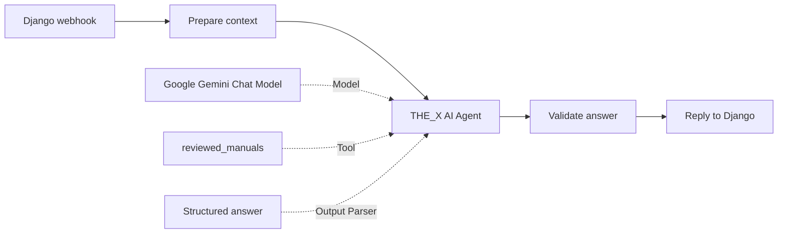

# THE_X AI chat — n8n + Gemini + PostgreSQL

อัปเดต 2 ตุลาคม 2026: Django/Compose ชี้ webhook `the-x-rag-draft` ของ workflow **THE_X RAG - THE_ONE structure - SETUP REQUIRED** แล้ว และส่ง `conversation_id` ที่ตรวจ owner แล้วให้ flow นี้ด้วย แต่ workflow ยังไม่ Publish และ PostgreSQL Memory, PGVector, Gemini credential, คู่มือ และ citation handoff ยังตั้งค่าไม่ครบ จึงยังใช้งานแชต AI จริงไม่ได้ ห้าม Publish จนกว่าจะปิดรายการเหล่านี้และทดสอบ end-to-end ผ่าน

## สถานะและขอบเขต

อัปเดต 26 กันยายน 2026: เตรียม workflow, Credentials, Django API, ประวัติ PostgreSQL, Flutter UI และระบบนำเข้าคู่มือแล้ว ผู้ใช้เลือก **ยังไม่มี Gemini key และยังไม่มีคู่มือ** จึงยังไม่เปิด workflow จริง และยังไม่มีผลทดสอบคุณภาพจากโมเดลจริง ไม่มีการใช้คำตอบจำลองแทน AI ในแอป

ใช้ n8n **2.28.6** pin image digest, Django **5.2.x**, PostgreSQL **17**, Flutter **3.44.2**; workflow ตั้งโมเดลเริ่มต้น `gemini-3.5-flash-lite` ตาม [เอกสารโมเดล Google](https://ai.google.dev/gemini-api/docs/models/gemini-3.5-flash-lite) ต้องตรวจว่า project/API key ของผู้ใช้มีสิทธิ์และ free quota ก่อนเรียกจริง เปลี่ยนโมเดลได้ที่ Google Gemini Chat Model ไม่ต้องแก้ Flutter

## Flow แบบ THE_ONE ที่เพิ่มภายหลัง

Workflow **THE_X AI Agent - THE_ONE style** เปิดได้ที่ http://localhost:15678/workflow/theXGeminiAgent และ export อยู่ที่ `n8n/workflows/the-x-gemini-agent.json` เป็น flow ทางเลือกที่ยังเก็บไว้ แต่ไม่ใช่ปลายทางปัจจุบันของแอป

ตรวจต้นแบบเพิ่มเติมจาก container `THE__ONE_V3` ที่เปิดขึ้นมาระหว่างทำงาน พบ workflow **Chatbot RAG** จริงและอ่านเฉพาะโครงสร้าง/การต่อ node โดยไม่คัดลอก credentials หรือ records จากนั้นสร้างร่างกราฟเต็ม **THE_X RAG - THE_ONE structure - SETUP REQUIRED** ที่ http://localhost:15678/workflow/theXOneRagDraft ไฟล์ `n8n/workflows/the-x-rag-draft.json` กราฟหลักตรงกับต้นแบบ แต่เพิ่ม authentication/validation และปรับให้แยกข้อมูล THE_X

ร่าง RAG ต่อครบ: Webhook → Agent พร้อม Gemini, Postgres Chat Memory, Vector Store QA Tool → PGVector Store + Gemini สำหรับสรุปหลักฐาน และ Gemini Embeddings ใต้ PGVector ไม่มี Ollama/chat-trigger ที่ไม่ได้ต่อใช้งานในต้นแบบ

**ร่าง RAG ยังใช้งานกับแอปไม่ได้และยังไม่ Publish:** รอฐาน THE_X ที่เปิด pgvector, credentials แยกสำหรับ retrieval/memory, ingestion/embedding คู่มือ, การส่งกลับ citation ที่ตรวจสอบได้ และการทดสอบจริง Django ส่ง conversation UUID หลังตรวจ owner แล้ว และ guard ของ flow ยังปฏิเสธ payload ที่ไม่มี UUID

ร่างใช้ `metadata` เป็น JSON column เดียว แทนค่าชื่อหลายคอลัมน์ที่พบในต้นแบบ; ต้องใส่ source/title/model/year/page ตอน ingest เลือก model/dimension ให้ตรงกันระหว่าง embed และค้น ลด topK จาก 5 เป็น 3 และ memory จาก 20 เป็น 4 เพื่อเริ่มทดสอบค่าใช้จ่าย ไม่ถือว่าค่านี้ให้คุณภาพดีที่สุดจนกว่าจะมี evaluation



- `Prepare context`: เลือกเฉพาะคำถาม ประวัติ 4 รอบ และ excerpts 3 ชิ้น จำกัดความยาว ไม่ส่ง headers/token/ข้อมูลบัญชีให้ Agent
- `reviewed_manuals`: Code Tool อ่าน excerpts ที่ Django ค้นจาก PostgreSQL สำหรับ request นี้แล้ว ไม่ใช้ query จากโมเดลไปรัน SQL หรือเปิด URL; เป็น keyword retrieval ไม่ใช่ PGVector
- `Structured answer` และ `Validate answer`: บังคับ `{reply, citation_ids}` กรอง citation ที่ไม่มีในข้อมูลจริง และคืน error แบบไม่เปิดเผย provider/credential details
- ประวัติยังเก็บใน Django/PostgreSQL ไม่เพิ่ม shared memory ใน n8n เพื่อไม่ปนประวัติผู้ใช้; ไม่มี embeddings/PGVector node ที่แสร้งว่าใช้งานได้
- จำกัด Agent 3 iterations, 1,200 output tokens ต่อ model call, ปิด parser auto-fix และ streaming; หนึ่งคำถามอาจเรียกโมเดลหลายครั้ง จึงใช้ quota/เวลามากกว่า HTTP flow เดิม ต้องทดสอบ latency จริงหลังใส่ key
- Workflow เดิม **THE_X Gemini chat** ยังอยู่ ใช้ HTTP Request และ Header Auth credential คนละชนิดกับ native Gemini node; ไม่คัดลอก key ข้าม credential อัตโนมัติ

อ่าน node behavior เพิ่มเติมจาก [n8n AI Agent](https://docs.n8n.io/integrations/builtin/cluster-nodes/root-nodes/n8n-nodes-langchain.agent) และ [Google Gemini Chat Model](https://docs.n8n.io/integrations/builtin/cluster-nodes/sub-nodes/n8n-nodes-langchain.lmchatgooglegemini)

ตรวจแล้ว: import ลง n8n 2.28.6 สำเร็จ, contract tests ของการต่อ node/จำกัด context/tool/citations/errors ผ่าน และรันสำเนาทดสอบด้วย native Agent/Gemini node จริงโดยกำหนด credential ที่ไม่มีอยู่ เพื่อยืนยันว่า error ผ่าน `Validate answer` แล้วเป็น `unavailable` โดยไม่เรียก provider สำเนา `TEST ONLY native Agent missing credential` ไม่ได้ Publish และไม่มีผลต่อ flow แอป ยังไม่ได้ทดสอบคำตอบ Gemini จริง การตัดสินใจเรียก tool ของโมเดล หรือประเมินคุณภาพ RAG

## สถาปัตยกรรม

Flutter → Django OIDC-protected API → n8n authenticated webhook → Gemini API → n8n validate JSON → Django persist → Flutter

- Django เป็นเจ้าของห้องสนทนาและประวัติใน PostgreSQL ฐานเดิม `the_x`; ตรวจ owner ทุกครั้ง ไม่ส่ง user ID, OIDC token, โปรไฟล์, รถ หรือข้อมูลจองไปให้ AI อัตโนมัติ
- n8n ใช้ PostgreSQL อีก service/volume สำหรับ workflows และ encrypted credentials มีสิทธิ์แยกจากฐานธุรกิจ; editor เปิดเฉพาะ `127.0.0.1:15678`
- Agent ใช้ n8n credential `THE_X Gemini native - enter key` ชนิด Google Gemini(PaLM) Api; webhook key คนละตัวกับ Google key
- Django รับ HTTP เฉพาะ `http://n8n:5678` เมื่อเปิด `AI_CHAT_INTERNAL_N8N=true` ใน compose เสริม; webhook อื่นต้อง HTTPS และห้าม redirect
- ไม่ส่ง browser ไปหา n8n/Google โดยตรง ไม่มี key ใน Flutter bundle

## เริ่มระบบจาก PowerShell

```powershell
cd D:\Project\Project_Flutter\mobiledev69
python scripts/setup_n8n.py
python scripts/setup_n8n_agent.py
docker compose --env-file deploy/.env -f compose.deploy.yaml -f compose.ai.yaml up -d --build --wait
```

สคริปต์เพิ่มค่า n8n ใน `deploy/.env` ที่ Git ignore อยู่ สร้าง webhook token/encryption key/password แบบสุ่ม และ import workflow/Credentials ครั้งแรก การรันซ้ำจะรักษา workflow และ key ที่กรอกแล้ว เก็บ marker ที่ `.local/n8n/initialized` อย่าลบ marker เพื่อพยายามแก้ปัญหา key และอย่าใช้ `docker compose down -v` เพราะจะลบฐานข้อมูลถาวร

เวลารัน THE_X พร้อม AI ต้องระบุ compose **ทั้งสองไฟล์** เหมือนคำสั่งข้างบน ตัว `compose.deploy.yaml` เดี่ยวไม่ได้เปิด internal n8n integration

`setup_n8n_agent.py` import Agent กับ blank native credential ครั้งแรก เก็บ marker `.local/n8n/agent-initialized` และร่าง RAG พร้อม marker `.local/n8n/rag-draft-initialized` ตั้ง `AI_CHAT_N8N_PATH=the-x-rag-draft` ใน `deploy/.env` จากนั้น restart backend ให้ชี้ webhook ของร่าง RAG การรันซ้ำไม่เขียนทับ workflow/key; ถ้าต้องการกลับ Agent flow ให้ตั้ง `AI_CHAT_N8N_PATH=the-x-gemini-agent` แล้วรัน compose `up -d --wait backend`

## สิ่งที่ต้องทำก่อนเปิด RAG flow จริง

1. เปิด [n8n ในเครื่อง](http://localhost:15678) สร้างบัญชี owner ของ n8n ด้วยข้อมูลที่ต้องการ บัญชีนี้แยกจาก Admin ของ THE_X
2. สร้าง Gemini API key ใน [Google AI Studio](https://aistudio.google.com/apikey) ตรวจ project/free tier และโควตาของโมเดล ห้ามส่ง key ในแชตหรือ Git
3. ใน n8n ไป Credentials → `THE_X Gemini native - enter key` → กรอก key ใน **API Key** โดยคง Host เป็น `https://generativelanguage.googleapis.com` → Save; ตรวจโมเดลและโควตาที่ใช้งานได้จริง
4. เตรียมฐาน PGVector แยกสำหรับ THE_X และ credential สิทธิ์เท่าที่จำเป็นให้ Postgres Chat Memory กับ Postgres PGVector Store; ตั้งค่า Google Gemini ทั้ง node ตอบและ embedding โดยไม่คัดลอกข้อมูล/credential จาก THE_ONE
5. นำเข้าคู่มือที่ตรวจสอบสิทธิ์และเนื้อหาแล้วด้วย embedding model/dimension เดียวกับตอนค้น พร้อมออกแบบ citation handoff ที่ตรวจ source ได้ และทดสอบการแยกประวัติหลายบัญชี, คำตอบ, latency, quota และกรณีไม่มีคู่มือ
6. เมื่อข้อ 3–5 ผ่านแล้วจึง Publish **THE_X RAG - THE_ONE structure - SETUP REQUIRED** เพื่อเปิด `/webhook/the-x-rag-draft` และทดสอบ [THE_X AI chat](http://localhost:18080/ai-chat) ผ่านบัญชีจริงโดยไม่ใส่ข้อมูลส่วนตัวในข้อความทดสอบ

Credential `THE_X Django webhook` เป็น token สำหรับ Django ที่ setup สร้างให้แล้ว ไม่ต้องนำ Google key ไปใส่ช่องนี้ และไม่ต้องเปิด n8n editor ผ่าน ngrok

## API และประวัติ

- `GET/POST /api/ai-conversations/`: รายการ 50 ห้องล่าสุดของบัญชีตน/สร้างห้อง
- `GET /api/ai-conversations/<uuid>/`: ล่าสุด 50 turns ในห้องตน
- `POST /api/ai-chat/`: `message`, `conversation_id`, `request_id` (UUID สำหรับ retry)
- ใช้ OIDC Bearer authentication เดิม ทุก response ประวัติตั้ง `Cache-Control: no-store`
- Turn มี `pending/completed/failed`, คำถาม, คำตอบ, sources, latency, error code; retry ด้วย UUID เดิมไม่สร้าง turn ซ้ำ และคำถามเดิมที่สำเร็จคืนคำตอบเดิม
- ป้องกันส่งพร้อมกันในห้องเดียวด้วย transaction, row lock และ partial unique constraint; pending ที่ค้างเกิน 60 วินาทีเปลี่ยนเป็น failed เพื่อ retry
- UI แสดงรอคำตอบ, ลองใหม่เมื่อผิดพลาด, ห้องใหม่/ประวัติ และแหล่งข้อมูลที่ backend ตรวจ ID แล้ว หากไม่มี citation จะแสดงว่าไม่มีคู่มืออ้างอิง

## RAG รุ่นแรกและการนำเข้าคู่มือ

ยังไม่มีข้อมูลคู่มือจริง ระบบเริ่มต้นค้น **คำค้น/ชื่อรุ่นที่ผู้ดูแลกำหนด** ใน chunks ที่ตรวจแล้วใน PostgreSQL (ไม่ใช่ pgvector/embedding หรือ semantic search) เหมาะกับ corpus เล็กสำหรับทดสอบ ค้นสูงสุด 500 chunks และส่งเฉพาะ 3 chunks ที่ตรงคำค้น แต่ละ chunk ยาวไม่เกิน 1,800 ตัวอักษร

ข้อจำกัด: คำสะกดต่าง/คำพ้องที่ไม่มีใน keywords อาจค้นไม่เจอ และการตรงคำค้นไม่ได้รับรองว่าคู่มือตรงรุ่น ต้องตรวจ retrieval และ citation ด้วยชุดคำถามจริง ก่อนขยายเป็น embedding/hybrid search และ re-ranking เมื่อมี corpus เพียงพอ

นำเข้าจากไฟล์ JSON ที่สกัดจากคู่มือที่มีสิทธิ์ใช้และตรวจเนื้อหาแล้ว โดยเก็บรุ่น ปี และหน้าให้ชัด ตัวอย่างโครงสร้าง (เป็นแม่แบบ **ไม่ใช่ข้อมูลซ่อมจริง**):

```json
[
  {
    "title": "ชื่อคู่มือและรุ่นรถ",
    "source_url": "https://manufacturer.example/manual",
    "locator": "รุ่น ปี หน้า/หัวข้อ",
    "keywords": ["ชื่อรุ่น", "คำค้นภาษาไทย", "คำพ้อง"],
    "content": "ข้อความสั้นที่ตรวจสอบกับคู่มือจริงแล้ว"
  }
]
```

วางไฟล์จริงไว้ที่ `.local/manual-excerpts.json` แล้วใช้:

```powershell
docker compose --env-file deploy/.env -f compose.deploy.yaml -f compose.ai.yaml run --rm --no-deps -v "${PWD}/.local:/imports:ro" backend python manage.py import_ai_knowledge /imports/manual-excerpts.json
```

ไฟล์ต้องเป็น UTF-8, array 1–500 รายการ, ไม่เกิน 2 MB; keywords 1–30 คำ; importer ตรวจทั้งชุดใน transaction และไม่เพิ่ม excerpt ซ้ำ เปิด Django Admin → Knowledge chunks → ตรวจแหล่ง รุ่น ปี เนื้อหา และสิทธิ์ใช้ข้อมูล → เปิด `is_active` หลังตรวจแล้วเท่านั้น

แหล่งอ้างอิงที่ Flutter แสดงมาจาก records ที่ backend ส่งจริงและโมเดลระบุ citation ID; ไม่ยอมรับ URL ที่โมเดลแต่งเอง อย่างไรก็ตาม ID ที่ถูกต้องไม่ได้รับรองว่าคำตอบตรงคู่มือ จึงยังต้องประเมิน citation correctness

## Token, latency, quota และความปลอดภัย

- ส่งประวัติสำเร็จก่อนหน้าสูงสุด 4 รอบ คำตอบใน context ตัดที่ 1,500 ตัวอักษรต่อรอบ; คำถามไม่เกิน 1,000 ตัวอักษร, Gemini output ไม่เกิน 1,200 tokens
- HTTP flow เดิมตั้ง provider timeout 20 วินาที; native Agent ใช้ n8n execution timeout 23 วินาที, Django upstream timeout 25 วินาที, Flutter receive timeout 30 วินาที โดย SDK อาจมี retry ภายในและการยกเลิกงาน upstream ต้องทดสอบจริง จับ provider `429` เมื่อมี status/message ที่ระบุได้ และคืนข้อความรอโควตา ไม่มีการเดาคำตอบซ่อมทดแทนเมื่อบริการล่ม
- Django จำกัด 10 คำถาม/นาที/บัญชีผ่าน Redis; ขีดจำกัดรวมของ Gemini ขึ้นกับ project และอาจต่ำกว่าผลรวมผู้ใช้ทั้งหมด จึงยังไม่รับรอง concurrency production
- กำหนด system instruction ให้ถามรุ่น/ปีเมื่อไม่ครบ ไม่เดาสเปกหรือราคา และให้หยุดขี่/พบช่างเมื่อมีอาการเสี่ยง เอกสารอ้างอิงเป็นข้อมูล ไม่ใช่คำสั่งให้ AI ปฏิบัติตาม
- Gemini free tier อาจใช้ข้อมูลปรับปรุงบริการตาม [เงื่อนไข Google](https://ai.google.dev/gemini-api/terms); UI เตือนไม่ใส่ชื่อ เบอร์โทร ที่อยู่ หรือทะเบียน ไม่กรอกหรือส่งข้อมูลส่วนตัวจริงในการทดสอบ
- n8n ไม่เก็บ execution payload ทั้ง success/error/manual; Django ไม่ log ข้อความ, API key หรือ raw provider errors ประวัติใน PostgreSQL ยังคงอยู่จนมีกระบวนการลบตามนโยบายที่กำหนดภายหลัง

## การตรวจสอบ

```powershell
node scripts/test_ai_workflow.cjs
node scripts/test_ai_agent_workflow.cjs
cd frontend
D:\flutter\bin\flutter.bat analyze
D:\flutter\bin\flutter.bat test
cd ..
docker compose --env-file deploy/.env -f compose.deploy.yaml -f compose.ai.yaml run --rm --no-deps -e DB_CONN_MAX_AGE=0 -e REDIS_URL= -e LOCAL_USERNAME_RESET_ENABLED=false -v "${PWD}/backend:/source:ro" -w /source backend python manage.py test garage --noinput
```

การทดสอบ Django ใช้ฐาน `test_the_x` แยกและ cache ภายใน process; ปิด flag รีเซ็ตแบบ demo เฉพาะ environment ทดสอบ เพื่อไม่ให้ปนกับ tests ที่ตรวจ production HTTPS

ผ่านทดสอบ Flutter 17 cases และ analyzer; ทดสอบ AI API เรื่อง ownership, replay, timeout/retry, 429, pending recovery, context budget, citation filtering และ importer; ทดสอบ workflow contract ด้วย Node และทดสอบ integration ผ่าน n8n จริงกับคำตอบ **synthetic** ลง PostgreSQL test DB แล้ว (ไม่ได้เรียก Gemini) workflow ทดสอบ `TEST ONLY - THE_X synthetic smoke` ถูก Unpublish หลังทดสอบ

ชุดคำถามภาษาไทย 30 ข้ออยู่ที่ `n8n/eval/thai_motorcycle.json` ยัง **ไม่ได้รันกับ Gemini** เมื่อ key พร้อมเริ่ม 3 ข้อก่อน:

```powershell
docker compose --env-file deploy/.env -f compose.deploy.yaml -f compose.ai.yaml run --rm --no-deps -v "${PWD}/n8n/eval:/eval:ro" -v "${PWD}/.local:/results" backend python manage.py evaluate_ai_chat /eval/thai_motorcycle.json --output /results/gemini-eval-first.jsonl --limit 3 --delay 15 --run
```

คำสั่งใช้โควตาจริงและหยุดเมื่อพบ error; ไม่เขียนทับไฟล์ผลเดิม เมื่อพร้อมค่อยเพิ่ม `--limit 30` และเปลี่ยนชื่อ output ประเมินด้วยคน: ความถูกต้อง/ความครบ, citation รองรับข้ออ้างจริงหรือไม่, retrieval recall จากแหล่งที่ควรพบ, การไม่แต่งสเปก/คำตอบ และคำแนะนำไม่ปลอดภัยต้องเป็นศูนย์ วัดเวลา median/p95, อัตรา 429/503 และจำนวนโทเคนจาก provider dashboard แยกจากคะแนนคำตอบ

ไม่ใช้คะแนน benchmark ทั่วไปเป็นหลักฐานความแม่นยำด้านซ่อมรถ; ไม่ประกาศผ่านคุณภาพหรือ SLA จนมีผลโมเดลจริงและคู่มือจริง

## หากเรียกไม่ได้

- Root cause: ยังไม่กรอก key หรือไม่ Publish workflow → กรอก Credential แล้ว Publish; เช็ก node Gemini model/สิทธิ์/โควตาใน Google project
- Environment cause: ใช้ compose เดี่ยวหรือ backend รุ่นเก่า → รันสองไฟล์พร้อม `up -d --build --wait`; เช็ก `docker compose ... ps`
- Secondary cause: หน้า Flutter เก่าหรือ pending ค้าง → reload URL ปกติ และโหลดประวัติใหม่หลัง 60 วินาที ไม่ต้องลบ login storage

อ้างอิง: [n8n HTTP Request](https://docs.n8n.io/integrations/builtin/core-nodes/n8n-nodes-base.httprequest), [n8n CLI](https://docs.n8n.io/deploy/host-n8n/configure-n8n/use-the-command-line), [Gemini generateContent](https://ai.google.dev/api/generate-content), [Gemini quotas](https://ai.google.dev/gemini-api/docs/rate-limits)
