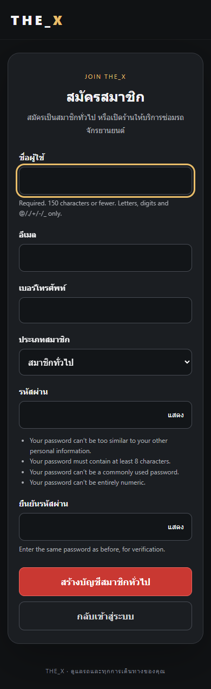
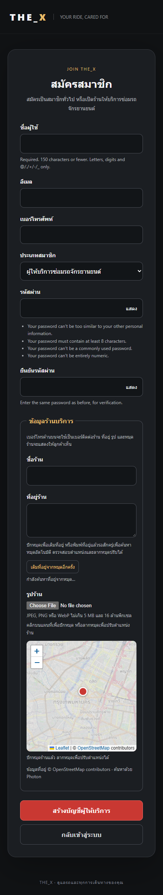
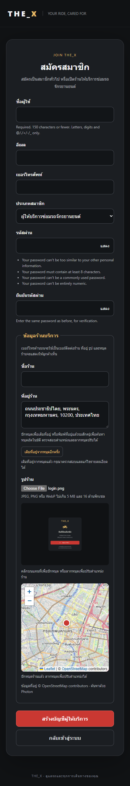

# ขอบเขต 4 — สมัครสมาชิกทั่วไปและผู้ให้บริการ

สถานะส่งมอบ 23 กันยายน 2026: ปิดขอบเขต 4 สำหรับ Flutter Web แล้ว สมัครสมาชิกบน Django 5.2.17 โดยคง Flutter OIDC Authorization Code + PKCE เดิม เลือกสมาชิกทั่วไปหรือผู้ให้บริการ พร้อมเบอร์โทร รูปร้าน และพิกัด บัญชีใหม่ต้อง [ยืนยันอีเมล](phase-4-email-accounts.md) ก่อนใช้งาน หลักฐานรวมอยู่ใน [ผลตรวจขอบเขต 4](phase-4-testing.md)

## การใช้งาน

1. เปิด `http://localhost:50000/login` แล้วกดเข้าสู่ระบบ THE_X
2. ที่หน้า Django เลือก **สมัครสมาชิกใหม่**
3. กรอกชื่อผู้ใช้ อีเมล เบอร์โทร รหัสผ่านและยืนยันรหัสผ่าน แล้วเลือกประเภทสมาชิก
4. สมาชิกทั่วไปกด **สร้างบัญชีสมาชิกทั่วไป** ได้เลย ผู้ให้บริการใส่ชื่อร้าน รูป และปักหมุดแผนที่ ระบบเติมที่อยู่ให้ตรวจสอบ/แก้ไข ก่อนกด **สร้างบัญชีผู้ให้บริการ** ช่องพิกัดซ่อนจากหน้าจอและยังส่งค่าจากหมุดให้ backend ตรวจ
5. เปิดลิงก์จากอีเมลและกดยืนยัน จากนั้นเข้าสู่ระบบด้วยบัญชีที่สร้างและยอมรับ Consent สมาชิกทั่วไปกลับโรงรถ ผู้ให้บริการเข้าหน้างานช่างและเปิด **ร้านบริการ** เพื่อดูร้านของตน รูป และลิงก์แผนที่

การสมัครรักษา `next` ของคำขอ OIDC รวม state และ PKCE challenge ไม่ออก token เองและไม่ login อัตโนมัติ ผู้ที่เปิด `/accounts/register/` โดยตรงจะกลับหน้า Login ของ Flutter หลังเข้าสู่ระบบ เพื่อเริ่ม OIDC

## สิ่งที่ตรวจและข้อจำกัด

- `account_type` เลือกได้เฉพาะ customer/mechanic ไม่รับค่า admin ไม่เชื่อ role/staff/superuser/groups ที่แทรกมา
- ผู้ให้บริการได้รับกลุ่ม mechanics และเป็นสมาชิกเฉพาะร้านใหม่ของตน ไม่มีสิทธิ์ Admin หรือร้านอื่น
- เบอร์โทรเก็บใน UserProfile และแสดงเฉพาะ `/api/me/` ของตนกับ Admin เบอร์ผู้ให้บริการใช้เป็นเบอร์สาธารณะของร้านด้วยตามข้อความในฟอร์ม
- ปุ่มแสดง/ซ่อนรหัสผ่านอยู่ภายในช่องกรอก ครอบคลุม Login สมัครสมาชิก Django Admin Login สร้างผู้ใช้ ตั้งรหัสผ่านผู้ใช้ และเปลี่ยนรหัสผ่านตนเอง กดแล้วไม่ submit ฟอร์มหรือเปลี่ยนค่ารหัส
- ตัวอย่างรูปร้านอยู่ใต้ช่องอัปโหลดและคำแนะนำขนาดไฟล์ทันที ก่อนส่วนแผนที่
- ปักหมุดแล้วเติมที่อยู่ผ่าน Photon โดยรอหยุดลาก/คลิก 700 ms ผู้ใช้ยังแก้ข้อความได้ ผลลัพธ์เก่าหรือผลที่มาถึงระหว่างพิมพ์จะไม่ทับข้อความที่แก้เอง มีปุ่มเติมใหม่โดยผู้ใช้เลือกเอง หากค้นหาไม่สำเร็จยังกรอกที่อยู่เองได้และไม่ล้างหมุด
- ใช้ password validation และ hashing ของ Django; ไม่แสดงรหัสผ่านกลับในฟอร์มที่ผิดพลาด
- ตรวจชื่อผู้ใช้ซ้ำตาม Django เดิม และอีเมลซ้ำแบบไม่สนตัวพิมพ์เล็ก/ใหญ่
- อีเมลใหม่ตัดช่องว่างหัวท้ายและเก็บตัวพิมพ์เล็ก ทั้งหน้าสมัครและฟอร์มแก้ผู้ใช้ใน Admin
- Database unique index ป้องกันอีเมลไม่ว่างซ้ำ รวมคำขอที่มาพร้อมกัน หน้าสมัครแสดง error เมื่อเกิด uniqueness race
- ผู้ใช้เก่าที่ไม่มีอีเมลยังใช้งานได้ ไม่เปลี่ยน User model หรือ role เดิม
- CSRF, no-store และการปฏิเสธ external `next` ยังคงทำงาน ผู้ที่ login อยู่จะไม่ถูกสลับบัญชีด้วยการสมัคร
- แก้กรณีมี Django session เดิม: ลิงก์สมัครบนหน้า Login เปิดฟอร์มได้ ไม่ redirect วนกลับหน้า Login การสร้างบัญชีใหม่ไม่เปลี่ยน session เดิมจนผู้ใช้ Login ใหม่เอง มี regression test ทั้ง backend และ browser
- บัญชีใหม่ inactive จนกดยืนยันอีเมล บน local ลิงก์ถูกพิมพ์ใน Terminal Django; ก่อนใช้ production ต้องกำหนด SMTP และ shared cache
- หน้าแก้โปรไฟล์ลูกค้า/ช่างเพิ่มแล้ว ดู [การใช้งานและสิทธิ์](phase-4-profile.md) การยืนยันอีเมล/ส่งซ้ำ/หมดอายุ กู้รหัสผ่าน และการจำกัดการขอลิงก์ซ้ำบน local อยู่ใน [งานบัญชี](phase-4-email-accounts.md) การจองช่วงเวลาและ deployment อยู่นอกส่วนนี้
- ข้อความสมัครอีเมลซ้ำอาจช่วยให้เดาว่าอีเมลถูกใช้แล้วได้ ต้องทบทวน UX และ rate limiting ร่วมกับ email verification ก่อนเปิดสาธารณะ

## ตั้งค่าและ migration

`PUBLIC_SIGNUP_ENABLED` ค่าเริ่มต้นตาม `DEBUG`; สามารถตั้ง `false` เพื่อซ่อนลิงก์และปิดทั้ง GET/POST หน้าสมัครได้ Production ควรปิดไว้จนกำหนด SMTP, shared cache, rate limiting และนโยบายจัดการบัญชีค้างครบ `FRONTEND_LOGIN_URL` ใช้กำหนดหน้ากลับ Flutter เมื่อไม่มี OIDC next โดยค่าเริ่มต้นคือ frontend origin แรกต่อด้วย `/login`

Migration `0004_unique_user_email` เพิ่ม unique index บน `LOWER(auth_user.email)` เฉพาะอีเมลไม่ว่าง ตรวจอีเมลซ้ำก่อนและหยุดหากพบ โดยไม่แก้/ลบข้อมูลผู้ใช้ หากเกิดกรณีนี้ต้องตรวจบัญชีที่เกี่ยวข้องก่อนรันอีกครั้ง การย้อน migration ลบเฉพาะ index ไม่ลบบัญชี

Migration `0005_registration_profile_shop_location` เพิ่ม UserProfile และฟิลด์รูป/พิกัดให้ Shop พร้อม constraint พิกัดต้องอยู่ในช่วงและมีครบทั้งคู่ ร้านเก่าไม่มีรูป/พิกัดยังใช้งานได้ ไม่สร้างพิกัดเดาให้ข้อมูลเก่า

รูปบันทึกใน `backend/media/shops/` ซึ่งถูก gitignore; local Django เสิร์ฟ `/media/` เฉพาะ DEBUG รูปต้องเป็น JPEG/PNG/WebP ไม่เกิน 5 MB และ 16 ล้านพิกเซล ใช้ Pillow 12.3.0 แปลงเป็น JPEG สูงสุด 1600x1600 ตั้งชื่อสุ่มและไม่เก็บ EXIF บัญชี/โปรไฟล์/ร้าน/สมาชิกบันทึกใน transaction และลบไฟล์ที่เพิ่งสร้างหากล้มเหลว API ร้านส่งรูป/พิกัดแบบอ่านอย่างเดียว ส่วน Admin แก้ข้อมูลเหล่านี้ได้

แผนที่ใช้ [Leaflet 1.9.4](https://leafletjs.com/examples/quick-start/) ที่เก็บไฟล์และ license ใน static ของโปรเจกต์ ตรวจ SHA-256 ของ JS/CSS ก่อนเก็บ ภาพแผนที่โหลดจาก OpenStreetMap พร้อม attribution และรักษา Referer ตาม [Tile Usage Policy](https://operations.osmfoundation.org/policies/tiles/) ไม่มีการอ่าน GPS อัตโนมัติ ต้องโหลดแผนที่ได้เพื่อเลือกหมุด Production ต้องจัดเตรียม media hosting และ tile provider ที่รองรับปริมาณผู้ใช้

ที่อยู่อัตโนมัติใช้ [Photon API](https://github.com/komoot/photon/blob/master/docs/api-v1.md) ผ่าน `POST /accounts/shop-address/` สำหรับหมุดเป็นที่อยู่ และ `POST /accounts/shop-geocode/` สำหรับที่อยู่เป็นหมุด ทั้งคู่ตรวจ CSRF และข้อมูลก่อนส่งต่อ ส่งเฉพาะพิกัดหรือข้อความที่อยู่ร้านที่กำลังค้นหา ไม่ส่งชื่อผู้ใช้/โทร/รหัสผ่าน ตั้งค่า upstream ด้วย `GEOCODING_REVERSE_URL` และ `GEOCODING_FORWARD_URL` (ค่าเริ่มต้น `https://photon.komoot.io/reverse` และ `https://photon.komoot.io/api`) cache ผล 24 ชั่วโมง จำกัดการเรียกใหม่รวมสองทิศทางหนึ่งครั้งต่อ 2 วินาทีผ่าน Django cache และ timeout 6 วินาที บริการ demo ไม่รับประกันความพร้อมใช้งานตาม [เงื่อนไข Photon](https://github.com/komoot/photon#demo-server) ที่อยู่อาจไม่ครบเลขที่บ้าน และผลค้นหาอาจเป็นเพียงตำแหน่งใกล้เคียง ผู้ใช้ต้องตรวจ/แก้ไข Production หลาย worker ต้องใช้ shared cache และผู้ให้บริการที่รองรับโหลด

พิมพ์ที่อยู่อย่างน้อย 3 ตัวอักษรแล้วหยุด 1.5 วินาทีจะค้นหาหมุด โดยรักษาข้อความที่พิมพ์ไว้ การคลิก/ลากหมุดจะค้นหาที่อยู่ใหม่แทนข้อความเดิม การทำรายการใหม่หรือเปลี่ยนประเภทสมาชิกยกเลิกผลเก่าทั้งสองทิศทาง เมื่อได้รับ 429 จะลองใหม่สูงสุดสองครั้ง หากค้นหาไม่สำเร็จคงข้อมูลเดิมและแสดงข้อความให้กรอก/ปักหมุดเอง

```powershell
Set-Location 'D:\Project\Project_Flutter\mobiledev69\backend'
.\.venv\Scripts\python.exe manage.py migrate --noinput
.\.venv\Scripts\python.exe manage.py test garage --noinput
.\.venv\Scripts\python.exe manage.py makemigrations --check --dry-run
```

เปิด Backend และ Preview แล้วทดสอบ browser:

```powershell
Set-Location 'D:\Project\Project_Flutter\mobiledev69'
npm.cmd run test:e2e:registration
npm.cmd run test:e2e:provider-registration
npm.cmd run test:e2e:registration-layout
```

Browser tests สร้างบัญชีสุ่มด้วยอีเมล `example.com` ไม่มีการส่งอีเมลหรือพิมพ์รหัส/token แล้วลบเฉพาะบัญชี ร้าน และรูปทดสอบของรอบนั้น ไม่สร้างรถหรือประวัติการซ่อม ไม่เปลี่ยนบัญชีจริง

## หลักฐาน

- PostgreSQL: ผ่าน 79 tests รวมอีเมล/เบอร์/ประเภทสมาชิก รูปปลอม/เกินขนาด พิกัดไม่ถูกต้อง rollback ทั้งข้อมูลและไฟล์ การค้นหาที่อยู่และพิกัด/cache/rate limit/CSRF และ regression เดิม
- `makemigrations --check --dry-run`: ไม่มี model migration ค้าง และ migration 0004/0005 ใช้กับ local สำเร็จ
- Browser: สมาชิกทั่วไปสมัครและเข้าโรงรถได้ รวมกรณีมี Django session เดิม ผู้ให้บริการปักหมุดบน map จริง อัปโหลดรูป และเข้าใช้งานร้านที่ตนสร้างได้ รูปจาก media ตอบ 200
- Browser: ปุ่มแสดง/ซ่อนรหัสผ่านผ่านทั้งหน้าลูกค้าและ Admin ทุกหน้าที่มีช่องรหัสผ่านในระบบปัจจุบัน
- Browser layout: ตรวจตำแหน่งปุ่มอยู่ภายในกรอบ input, ช่องพิกัดซ่อน, รูปอยู่ก่อนแผนที่, ค้นหาจากบริการจริงทั้งสองทิศทาง และจำลองผลลัพธ์ล่าช้า/502/429 ยืนยันว่าการเลือกครั้งล่าสุดมีผลและลองใหม่อัตโนมัติ
- ตรวจภาพมือถือ ไม่มี horizontal overflow ฟอร์มเลื่อนถึงปุ่มสมัครและกลับเข้าสู่ระบบได้
- Flutter analyze ผ่าน, 8 tests ผ่าน, web release build สำเร็จ พร้อมแสดงรูปร้านและปุ่มเปิดตำแหน่งบนแผนที่






